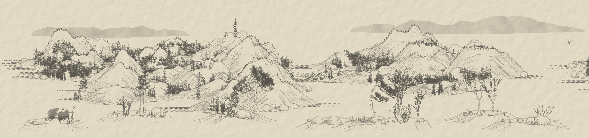

<div align="center">
<picture>
  <source media="(prefers-color-scheme: dark)" srcset="./public/img/shanshui_logo_light.png">
  
</picture>
<h1>{Shan, Shui}*</h1> 
</div>
<br>

Discover the beauty of an ever-evolving Chinese landscape art. This project combines the elegance of procedural generation with the power of vector graphics to create a mesmerizing, infinite-scrolling journey.



The landscape unrolls on its own. Drag it (or flick it) to look around, or use a trackpad, the mouse wheel or the arrow keys. The bar at the bottom pauses it, changes the speed and goes fullscreen, and the controls fade away while you watch. In the menu section, you can find an option to download the whole or part of your art as an SVG or to share it with your friends.

The painting follows the conventions of Shan Shui (山水) ink landscapes: pure ink tones on silk, mist dissolving the feet of the mountains, paler peaks in the distance, a rhythm of open water and gathering massifs crowned by a host peak, moss dots, waterfalls, travellers, fishing boats and geese, and now and then a classical poem inscribed in the sky with a red seal. Night mode paints it by moonlight. The same `?seed=` always paints the same landscape, on any screen.

Painting options, chosen in the URL (they combine, e.g. `?style=pillars&season=winter`):

| URL | Effect |
| --- | --- |
| `?style=classic` (default) | Rounded Shan Shui mountains |
| `?style=pillars` | Sheer sandstone columns like Zhangjiajie, rising out of mist |
| `?style=blend` | Stretches of pillars among classic mountains |
| `?season=summer` (default) | Pure ink |
| `?season=spring` | Blossom on the deciduous trees |
| `?season=autumn` | Ochre and rust leaves |
| `?season=winter` | A snow scene: washed grey sky, snow-covered mountains, falling snow |
| `?weather=clear` (default) | — |
| `?weather=rain` | Fine falling rain, paler ink, more cloud |

The options are part of the link: Share and Reload keep them, and the same seed and options always paint the same picture.

| Key | Action |
| --- | --- |
| Space | Play / pause |
| ← → | Scroll while held (Shift for faster) |
| Page Up / Page Down | Move a screen |
| Home | Back to the start |
| + − | Auto-scroll faster / slower |
| F | Fullscreen |
| H | Hide / show the controls |
| D | Dark mode |
| ? | List of shortcuts |

## 🏗️ Tech stack

React, TypeScript and SVG. Nothing more! ✨

## ⚙️ Installation

[Check it in online](https://shan-shui.vercel.app/) or locally:

```
bun install
bun start
```

## 📖 Documentation

[Check it in online](https://megaemce.github.io/shan_shui_docs/) or generate it locally with TypeDoc from Shan_Shui project.

```
bun docs
```

## 📜 Versions

This is the third iteration of this app:

1. Firstly created as a [monolithic JavaScript file](https://github.com/LingDong-/shan-shui-inf) by [Lingdong Huang](https://github.com/LingDong-)
2. Then it was [rebuilt with React 17](https://github.com/RedContritio/shan_shui_inf) by [RedContritio](https://github.com/RedContritio) without changing the source code
3. I have rebuilt it using React function components, employing an object-oriented programming approach. Additionally, I have addressed several bugs and incorporated various improvements for enhanced performance and readability:

    - Dark mode was added,
    - Some of the most complex elements were simplified,
    - Whole code was rewritten and commented using JSDoc,
    - [Fastest way to work with array](https://annoyscript.vercel.app/posts/The%20fastest%20way%20to%20work%20with%20arrays/) was implemented wherever it was reasonable,
    - Invisible objects are removed from the DOM for faster rendering and lower memory consumption,
    - Designing and rendering is done via [web workers](https://developer.mozilla.org/en-US/docs/Web/API/Web_Workers_API/Using_web_workers) and [promises](https://developer.mozilla.org/en-US/docs/Web/JavaScript/Reference/Global_Objects/Promise) for parallel computation, preventing [main thread blockages](https://web.dev/articles/optimize-long-tasks?utm_source=devtools).
      <br>
      <br>

    | | [DCL](https://developer.mozilla.org/en-US/docs/Web/API/Document/DOMContentLoaded_event) | [FCP](https://web.dev/articles/fcp) | [LCP](https://web.dev/articles/lcp) | Longest task |
    | --- | :-: | :-: | :-: | :-: |
    | Old  | 4.92s | 4.92s | 6.18s | 2.02s |
    | New  |  0.19s | 0.25s | 0.25s | 0.23s |
    | Diff | ⏬25x | ⏬19x | ⏬25x | ⏬8x |